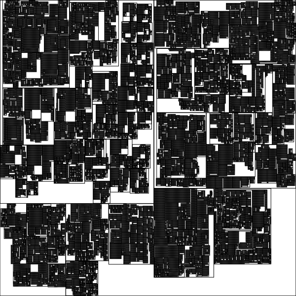

# HeiankyoView
An fast algorithm to visualize tree structures.  
My past work in B.S.

## What is Heian-kyo?
Heian-kyo was one of the several former names for the city now known as Kyoto.  
Please see the [wikipedia page](https://en.wikipedia.org/wiki/Heian-ky%C5%8D).  

## So, what is HeiankyoView?
This algorithm is named HeiankyoView becaused the visulization image is just like the
map of Heian-kyo.  


HeiankyoView is originally developed by Takayuki Itoh and
the algorithm is improved later by a prominent bachelor student,
Akira Hayakawa of Kyoto university.

### It's time to visualize the Linux kernel source tree!  

 
## Example
heiankyoview command is a simple tool
to pack tree structures.

As an input, you must write edge list like below.  
We shall save this to a file edgelist.sample.  

INPUT:  
```
$ cat edgelist.sample
1,2
1,3
2,4
```

We will feed the file to heiankyoview command.  
Each row describe (NodeID, xCoord, yCoord, width, height).

OUTPUT:  
```
$ heiankyoview edgelist.sample
1,0.000000,0.000000,12.000000,22.000000
3,-1.000000,-6.000000,8.000000,8.000000
2,0.000000,5.000000,10.000000,10.000000
4,0.000000,5.000000,8.000000,8.000000
```

## Installation and Testing
Run `#make install` and HeiankyoView is simply ready.  
For testing, run `$make runtest` and `$heiankyoview edgelist.sample` are provided.

## Developer Info
Akira Hayakawa(@akiradeveloper)  
e-mail: ruby.wktk@gmail.com
